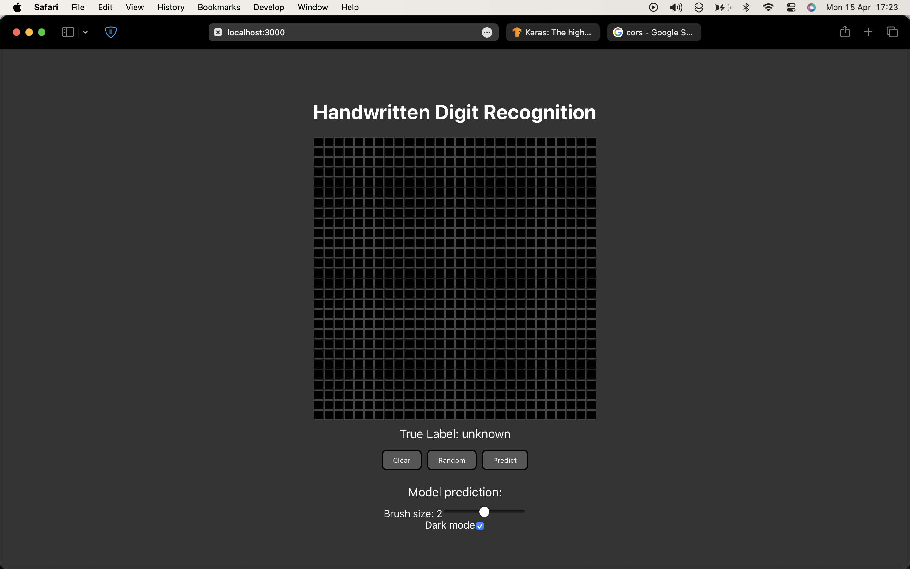
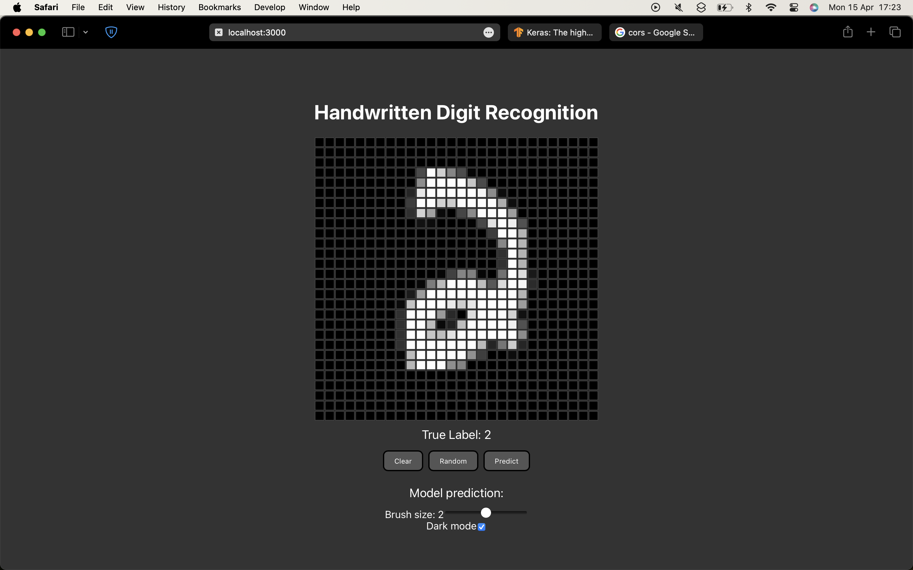
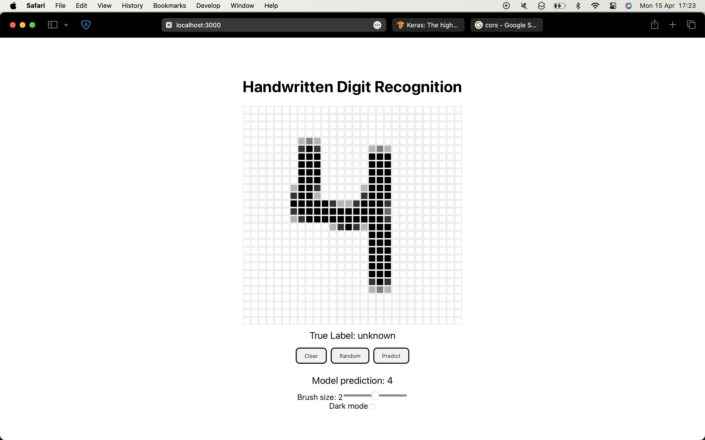
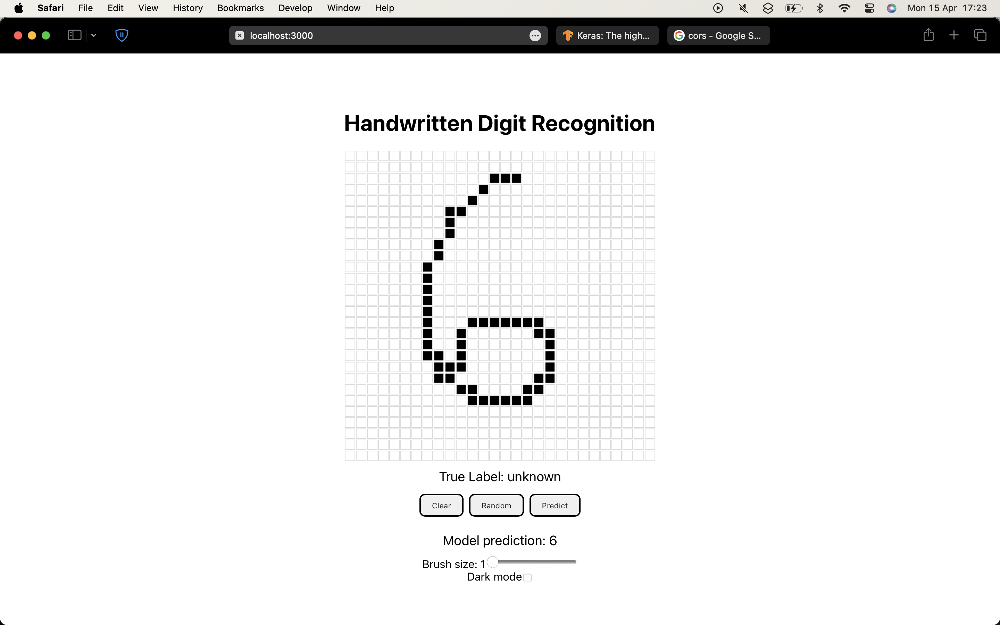

# MNIST-Webapp
This webapp uses a Convolutional Neural Network (CNN) trained on the MNIST digits dataset to predict the digit drawn by the user. The webapp is built using Flask for the backend and React for the frontend. The CNN model is built using TensorFlow and Keras.

## Requirements
- Python 3 and the following packages:
  - Flask
  - TensorFlow
  - Keras
  - NumPy

- Node.js and npm


## Installation
1. Clone the repository
2. Install the required Python packages using pip
3. Install the required Node.js packages running `npm install` in the `frontend` directory
4. Run the Flask server by running `python flask_server.py` in the `backend` directory
5. Run the React app by running `npm start` in the `frontend` directory
6. Open the webapp in your browser by going to `http://127.0.0.1:3000/`

## Usage
1. Draw a digit in the canvas
2. Click the `Predict` button to get the model's prediction
3. Click the `Clear` button to clear the canvas
4. Alternatively, you can click the `Random` button to get a random image from the test dataset, this images were not used in the training process but belong to the same distribution as the training data.

<!--
## Model
The CNN model used in this webapp was trained on the MNIST digits dataset. The model was trained using TensorFlow and Keras and achieved an accuracy of 99.39% on the test dataset. The architecture of the model is as follows:

```
Model: "sequential"
_________________________________________________________________
Layer (type)                 Output Shape              Param #
=================================================================
conv2d (Conv2D)              (None, 26, 26, 32)        320
_________________________________________________________________
max_pooling2d (MaxPooling2D) (None, 13, 13, 32)        0
_________________________________________________________________
conv2d_1 (Conv2D)            (None, 11, 11, 64)        18496
_________________________________________________________________
max_pooling2d_1 (MaxPooling2 (None, 5, 5, 64)          0
_________________________________________________________________
flatten (Flatten)            (None, 1600)              0
_________________________________________________________________
dense (Dense)                (None, 128)               204928
_________________________________________________________________
dropout (Dropout)            (None, 128)               0
```
-->

## Screenshots





## To-Do
- [ ] Add more information about the model
- [x] Add a button to switch between light and dark mode
- [ ] Add a button to download the canvas image